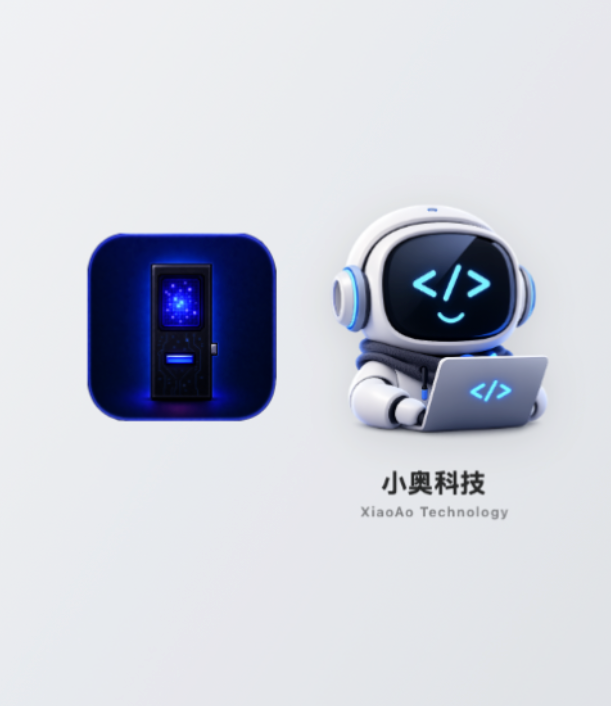
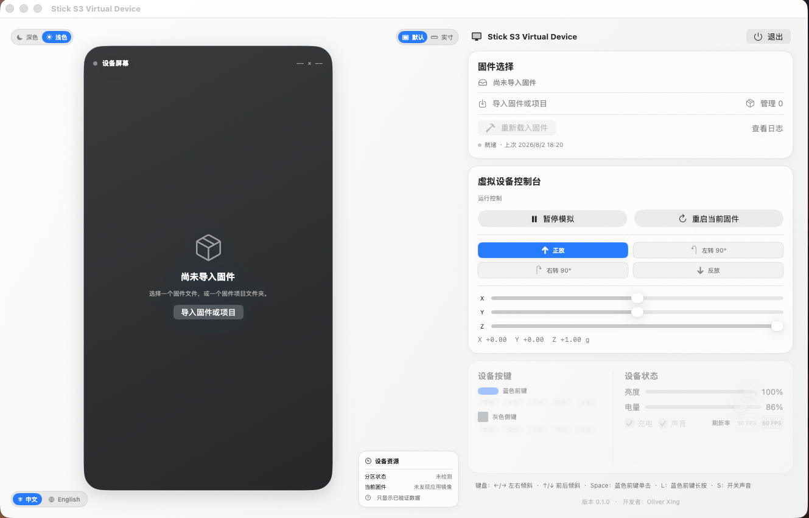
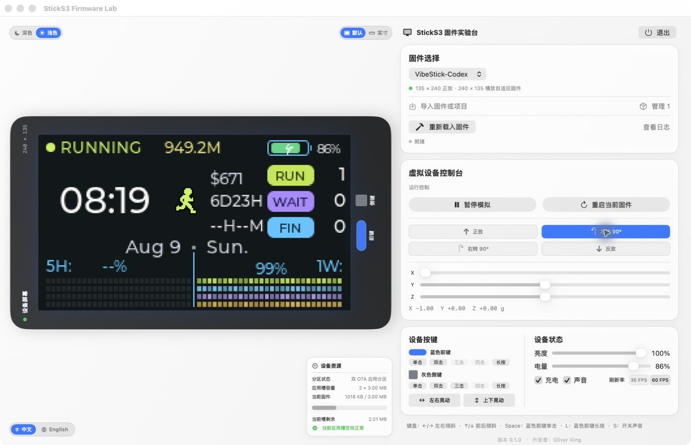
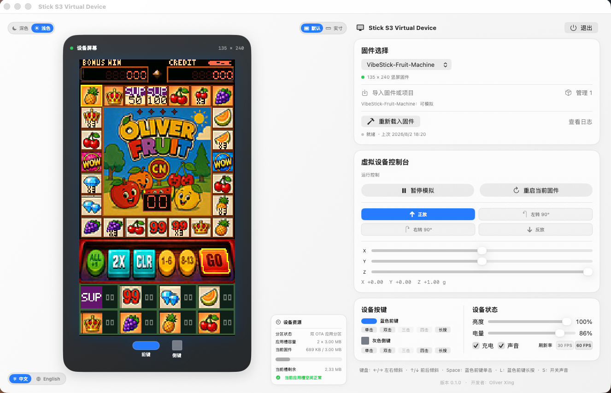

<div align="center">
  <h1>Stick S3 Virtual Device</h1>
  <p><strong>Native macOS virtual device for M5Stack StickS3 firmware</strong></p>
  <p>
    Build compatible StickS3 source projects in a private copy and bring their<br>
    display, physical buttons, and BMI270 pose input into one macOS console.
  </p>
  <p>
    <a href="#overview">Overview</a> ·
    <a href="#whats-new-in-v020-beta">v0.2.0 Beta</a> ·
    <a href="#sticks3-source-project-compatibility">Compatibility</a> ·
    <a href="#complete-controls">Controls</a> ·
    <a href="#installation">Install</a> ·
    <a href="#testing-status-and-windows-support">Support</a> ·
    <a href="#build">Build</a> ·
    <a href="README.zh-CN.md">简体中文</a>
  </p>
  <p>
    
    
    
    
    
  </p>
</div>

## What's new in v0.2.0 Beta

This open-source beta was published on August 3, 2026. Source code and an
unnotarized macOS Apple Silicon build are provided through GitHub for community
testing, feedback, and improvement.

- **Source-project simulation:** ESP-IDF, PlatformIO, and Arduino source
  projects have completed end-to-end build, display, button, and BMI270 tests.
- **Whole-device pose simulation:** portrait, left 90°, right 90°, and upside
  down rotate the body, display, and physical buttons together.
- **Fixed desktop viewport:** the application does not scroll horizontally or
  vertically; the complete control surface stays in one window.
- **Safe project reload:** refresh an imported source project without modifying
  its original files.

## Overview

<div align="center">
  
</div>

Stick S3 Virtual Device is a native macOS environment for importing, running,
and interacting with StickS3 firmware projects in a physical-device shell.

| | Capability | What it adds |
| --- | --- | --- |
| **01** | Source-project import | Adds compatible StickS3 source projects to one local catalog, identifies their build system, and checks simulation compatibility. |
| **02** | Normal display and controls | Connects compatible source projects to their firmware display, both physical buttons, and BMI270 pose input. |
| **03** | Safe project reload | Refreshes changed project source without modifying the original directory. |
| **04** | Local-first data | Keeps imported paths, settings, and test data on the Mac rather than uploading them to a service. |

> [!NOTE]
> This application complements real-device testing. Display color, physical
> sensor noise, ES8311 response, ESP32 memory and task scheduling, OTA metadata,
> partitions, and flash safety still require a physical StickS3.

<div align="center">
  
</div>

## Device experience

- Choose imported firmware from one shared catalog.
- Switch between the readable default scale and a physical-size reference.
- Rotate the complete virtual device to four supported poses.
- Drive X, Y, and Z gravity independently with the control console.
- Trigger single, double, triple, quadruple, and long presses for both buttons.
- Adjust battery, charging, audio, brightness, and refresh-rate state when the
  current firmware supports those controls.
- Pause simulation or restart the current firmware without restarting the app.
- Inspect firmware capacity and application-image resource usage.
- View reload progress and logs.

<div align="center">
  
</div>

## StickS3 source-project compatibility

The application recognizes common StickS3 firmware project layouts. It can
import an ESP-IDF project root, a `firmware/sticks3` directory, a
PlatformIO/Arduino project containing `platformio.ini`, or an Arduino project
containing an `.ino` sketch, then manage it from the shared firmware catalog.

The app builds in a private copy outside the imported project and connects the
display, both physical buttons, and BMI270 pose input for common StickS3
firmware based on M5Unified/M5GFX. QEMU ships with the app. Source projects
require either [PlatformIO Core](https://docs.platformio.org/en/latest/core/installation/methods/installer-script.html)
or the optional [ESP-IDF Installation Manager](https://docs.espressif.com/projects/idf-im-ui/en/latest/),
depending on project type. The app provides the same official download links
and does not require Homebrew.

This release focuses on normal firmware display and controls. It does not
simulate Wi-Fi, Bluetooth, cloud services, USB, or ULP programs. Projects that
access those peripherals directly, use custom display drivers, or bypass
M5Unified/M5GFX may still need compatibility work. This product does not import
precompiled `.bin` files from M5Burner or other sources. Bundled QEMU is only
an internal execution backend for adapted source-build outputs.

## System requirements

| Item | Requirement |
| --- | --- |
| Mac | Apple Silicon |
| Operating system | macOS 14 or later |
| Source build | Xcode command-line tools and Swift 6 |
| Display | Fixed application window; no horizontal or vertical page scrolling |
| QEMU | Included with the app; no separate install required |
| PlatformIO | Required for Arduino/PlatformIO source projects; the app provides an official download link |
| ESP-IDF | Optional; required only for ESP-IDF source projects |
| Network | Required to install build tools and new project dependencies; cached components are reused |

## Testing status and Windows support

> [!IMPORTANT]
> This early release has not yet undergone repeated validation across multiple
> Mac models, macOS versions, and hardware configurations. If you encounter any
> problem, please report it through
> [GitHub Issues](https://github.com/oliverxing2025/StickS3-Virtual-Device/issues).
> Feedback is welcome, and the application will continue to be corrected and
> updated as issues are identified.

> [!NOTE]
> A Windows version is not currently available. As an independent developer
> with limited time and development capacity, I have focused on the macOS
> version. Thank you for your understanding.

## Installation

### Release build

Anyone can download
`Stick-S3-Virtual-Device-v0.2.0-beta-macOS-arm64.zip` from
[GitHub Releases](https://github.com/oliverxing2025/StickS3-Virtual-Device/releases).
Verify the SHA-256 value shown on the release page before opening it.

1. Extract the ZIP on an Apple Silicon Mac.
2. Drag **Stick S3 虚拟设备.app** into **Applications**.
3. Control-click the app, select **Open**, then confirm **Open** in the dialog.
4. If Gatekeeper still blocks it, open **System Settings → Privacy & Security**,
   confirm the app source, and choose **Open Anyway**.

For source projects, use the corresponding official download button in
**Firmware Manager**:

- Arduino / PlatformIO: [download PlatformIO Core](https://docs.platformio.org/en/latest/core/installation/methods/installer-script.html)
- ESP-IDF (optional): [download ESP-IDF Installation Manager](https://docs.espressif.com/projects/idf-im-ui/en/latest/)

Return to the app and select **Check Again** after installation.

> [!WARNING]
> This open-source beta uses ad-hoc signing and does not have a Developer ID
> signature or Apple notarization. macOS will show a Gatekeeper warning. Only
> download it from this repository's official Release page and verify its
> SHA-256 value. Users who prefer not to bypass that warning should build from
> source or wait for a future signed release.

### Run from source

```sh
./scripts/run.sh
```

## Quick start

1. Launch the application.
2. Select **Import firmware or project** and choose an ESP-IDF or
   PlatformIO/Arduino project root, a `firmware/sticks3` directory, an Arduino
   `.ino` project directory.
3. Open **Manage** to inspect compatibility and project status.
4. Start a compatible firmware project.
5. Use pose, motion, and physical-button controls to exercise the firmware
   display and normal interactions.
6. After changing firmware source, choose **Reload firmware**.

Imported source directories are read-only references. Removing an entry from
the catalog does not delete or modify the original project.

<div align="center">
  
</div>

## Complete controls

### Device console

| Control | Effect |
| --- | --- |
| Default / Physical size | Switch between readable scale and a 2× reference based on the 48 × 24 mm device face |
| Upright | Send the default StickS3 gravity pose |
| Left 90° / Right 90° | Rotate the complete body, display, buttons, and gravity axes |
| Upside down | Rotate the complete device by 180° |
| X / Y / Z | Adjust simulated BMI270 gravity |
| Blue front button | Single, double, triple, quadruple, or long press |
| Gray side button | Single, double, triple, quadruple, or long press |
| Brightness / Battery | Update the simulated device state |
| Charging / Sound | Toggle charging and firmware audio |
| 30 FPS / 60 FPS | Select display refresh rate |

Available controls depend on the current firmware and runtime mode. Generic
source-project compatibility focuses on the display, both physical buttons,
and BMI270 pose input; controls that are not connected are disabled in the UI.

Button bindings remain firmware-owned. A dimmed gesture is intentionally
unbound; the simulator does not invent a behavior.

### Keyboard

| Key | Action |
| --- | --- |
| `←` / `→` | Tilt left or right |
| `↑` / `↓` | Tilt forward or backward |
| `Space` | Blue front-button single press |
| `L` | Blue front-button long press |
| `S` | Toggle sound |

## Importing and reloading firmware

- Import one ESP-IDF or PlatformIO/Arduino project root, a `firmware/sticks3`
  directory or an Arduino `.ino` project directory at a time.
- The application checks the project structure and reports whether it can run.
- After source files change, use **Reload firmware** to refresh the project.
- Imported directories remain read-only and are never modified by the app.
- Projects that directly require Wi-Fi, Bluetooth, cloud services, USB, ULP,
  or custom hardware drivers are clearly identified when further work is needed.
- Precompiled `.bin` files are not imported; use a source project that the app
  can copy and adapt privately.

The project catalog is stored under
`Application Support/Stick S3 Firmware Simulator/`. It remains outside the
synchronized workspace and outside Git.

## Project structure

```text
.
├── assets/screenshots/
│   ├── empty-firmware-library.png
│   ├── landscape-control-console.png
│   ├── running-firmware-console.png
│   └── stick-s3-virtual-device-brand.png
├── Resources/
│   ├── AppIcon-1024.png
│   ├── Info.plist
│   ├── SplashAvatar.png
│   └── VirtualBoard/
├── Sources/
├── Tests/
├── Vendor/
├── scripts/
├── Package.swift
├── README.md
└── README.zh-CN.md
```

Build products, local SwiftPM state, firmware binaries, logs, credentials,
recordings, and machine state are intentionally excluded from Git.

## Build

```sh
swift test
./scripts/build-app.sh
```

Install the built application on the desktop:

```sh
./scripts/install-desktop.sh
```

Local builds use ad-hoc signing by default. A distributor can explicitly set
`CODESIGN_IDENTITY` and complete Developer ID signing and notarization.

## Privacy and local data

- Imported project paths are stored only in local Application Support.
- Optional local connection credentials are used only when explicitly
  provided by the user.
- Credentials remain in memory and are not displayed, copied, or written to
  the simulator catalog.
- A clean installation does not read unrelated macOS Keychain entries.
- User project paths are not frozen into the distributed application binary.
- The simulator does not flash, erase, or modify a physical StickS3.

## Asset and dependency notes

The application artwork is project-owned. LVGL, Montserrat, and imported
firmware snapshots retain their upstream licenses and notices under
`Vendor/Licenses/`, `NOTICE`, and `THIRD_PARTY_NOTICES.md`.
Every public binary release must also attach the third-party source bundle
generated by `scripts/prepare-third-party-sources.sh`.

## License

Source license terms are provided in [LICENSE](LICENSE). Third-party attribution
and firmware snapshot terms are provided in [NOTICE](NOTICE) and
[THIRD_PARTY_NOTICES.md](THIRD_PARTY_NOTICES.md).
