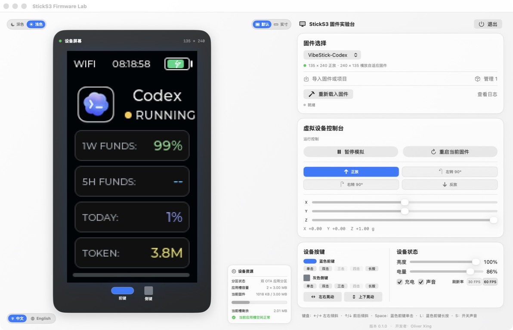

<div align="center">
  <h1>StickS3 固件实验台</h1>
  <p><strong>面向 M5Stack StickS3 源码工程的原生 macOS 固件实验台</strong></p>
  <p>
    在私有副本中构建兼容的 StickS3 源码工程，并将固件画面、<br>
    实体按键和 BMI270 姿态输入接入同一个 macOS 实验台。
  </p>
  <p>
    <a href="#项目概览">项目概览</a> ·
    <a href="#v020-beta-公开测试">v0.2.0 Beta</a> ·
    <a href="#sticks3-源码工程兼容">固件兼容</a> ·
    <a href="#完整控制">完整控制</a> ·
    <a href="#安装">安装</a> ·
    <a href="#测试状态与-windows-支持">支持说明</a> ·
    <a href="#构建">构建</a> ·
    <a href="README.md">English</a>
  </p>
  <p>
    
    
    
    
    
  </p>
</div>

## v0.2.0 Beta 公开测试

**发布日期：**2026 年 8 月 9 日

源代码已按 MIT 许可证开放公开测试。可从
[v0.2.0 Beta 发布页](https://github.com/oliverxing2025/StickS3-Firmware-Lab/releases/tag/v0.2.0-beta)
下载当前 macOS 版本及校验文件，也可从该标签自行构建。如发现可复现问题，
请通过 [GitHub Issues](https://github.com/oliverxing2025/StickS3-Firmware-Lab/issues) 反馈。

- **Agent Hub 运行时：**原生运行 VibeStick-Agent-Hub 启动选择界面，可进入 Codex、Claude Code 或 Kimi，并通过侧键三连击顺序切换。
- **Codex 本地数据：**自动发现已安装的本机回环 VibeStick Bridge，使用其本地配置，但不显示或复制凭据。
- **真实反映接入状态：**Codex 可显示 Bridge 实时数据；Claude Code 与 Kimi 在各自 Bridge 接入前明确显示离线，不挪用 Codex 数据。
- **整机姿态模拟：**正放、左转 90°、右转 90°、反放会同时旋转机身、屏幕和实体按键。
- **固定桌面视口：**页面不能上下或左右滚动，完整控制区始终保持在同一个窗口内。
- **安全项目重载：**固件源码变化后可以重新载入，不修改原项目文件。
- **感知硬件的适配：**从源码识别常见屏幕、按键与 BMI270 映射，无法确定时可在本机校准。
- **更快的迭代：**只在源码与适配器输入都未变化时复用私有构建缓存。

## 项目概览

<div align="center">
  
</div>

StickS3 固件实验台是用于导入、运行和操作 StickS3 固件项目的原生 macOS
环境，并通过完整的虚拟机身呈现固件界面。

| | 能力 | 作用 |
| --- | --- | --- |
| **01** | 源码工程导入 | 将兼容的 StickS3 源码工程加入本机目录，识别构建体系并检查模拟兼容状态 |
| **02** | 常规显示与操作 | 为兼容的源码工程接入固件画面、两个实体按键和 BMI270 姿态输入 |
| **03** | 硬件识别与校准 | 识别常见屏幕、按键与 BMI270 映射；需要时在本机保存与源码绑定的校准 |
| **04** | 安全重载与构建缓存 | 在私有副本重建变更的源码，只复用完全匹配的缓存 |
| **05** | 本地数据优先 | 导入路径、设置和测试数据保留在 Mac 本机，不上传到网络服务 |
| **06** | Agent Hub | 复现 VibeStick-Agent-Hub 的启动选择和侧键三连击切换逻辑 |

> [!NOTE]
> 本应用用于补充真机测试。屏幕色差、真实传感器噪声、ES8311 响应、
> ESP32 内存与任务调度、OTA 元数据、分区和烧录安全仍需 StickS3 真机验收。

## 设备体验

- 从同一份目录选择用户主动导入的固件。
- 在清晰的默认比例和实体尺寸参考之间切换。
- 将完整虚拟设备旋转为四种支持姿态。
- 通过控制台独立调整 X、Y、Z 重力方向。
- 触发左右或上下晃动手势，完成后回到原重力姿态。
- 触发两个实体按键的单击、双击、三击、四击和长按。
- 在当前固件支持时调整电量、充电、声音、亮度和刷新率状态。
- 暂停模拟或重启当前固件，不必重启应用。
- 查看分区容量和应用镜像资源使用情况。
- 查看重新载入进度和日志。
- 查看自动硬件识别结果，并对无法确定的传感器轴、按键或屏幕旋转进行本地校准。
- 让兼容固件连接同一台 Mac 上明确运行的回环数据服务；外网与局域网请求会被拒绝。

<div align="center">
  
</div>

## StickS3 源码工程兼容

本应用面向常见 StickS3 固件源码项目设计。用户可以导入 ESP-IDF 项目根目录、
`firmware/sticks3` 目录、带 `platformio.ini` 的 PlatformIO/Arduino 工程，或
包含 `.ino` 草图的 Arduino 工程，并通过统一的固件目录检查和管理。

应用会在原工程之外创建私有构建副本，并为采用 M5Unified/M5GFX 的常见 StickS3
固件接入屏幕、两个实体按键和 BMI270 姿态桥接。QEMU 已随应用提供；源码工程需要
用户按项目类型自行安装 [PlatformIO Core](https://docs.platformio.org/en/latest/core/installation/methods/installer-script.html)
或 [ESP-IDF Installation Manager](https://docs.espressif.com/projects/idf-im-ui/en/latest/)。
ESP-IDF 对整个应用而言是可选扩展，但导入 ESP-IDF 工程时必须安装。
应用内提供相同的官方下载入口，不要求使用 Homebrew。

本版本聚焦普通固件的画面与常规操作，不模拟 Wi-Fi、蓝牙、云服务、USB 和 ULP
程序。直接访问这些外设、采用自定义显示驱动或不使用 M5Unified/M5GFX 的项目，
仍可能需要进一步兼容。本产品不导入 M5Burner 或其他渠道提供的已编译 `.bin`；
内置 QEMU 仅作为适配后源码构建结果的内部执行后端。

兼容固件的主机数据通道仅能访问同一台 Mac 上的 HTTP(S) 服务。
应用会拒绝外网与局域网地址；该回环桥接不会为模拟固件提供通用网络访问。

## 系统要求

| 项目 | 要求 |
| --- | --- |
| Mac | Apple Silicon |
| 操作系统 | macOS 26 或更高版本 |
| 源码构建 | Xcode 26 命令行工具与 Swift 6.2 或更高版本 |
| 页面 | 固定应用窗口，不允许上下或左右滚动 |
| QEMU | 随应用提供，无需另行安装 |
| PlatformIO | Arduino/PlatformIO 源码工程需要；应用内提供官方下载入口 |
| ESP-IDF | 导入 ESP-IDF 源码工程时必需；Arduino/PlatformIO 项目不需要 |
| 网络 | 安装构建工具及项目新增依赖时需要联网；已缓存组件会复用 |

## 测试状态与 Windows 支持

> [!IMPORTANT]
> 本 App 由个人独立开发，可用的测试平台相对单一，完整兼容性测试也需要较长时间。
> 当前测试版尚未在多台不同型号的 Mac、多个 macOS 系统版本及不同硬件环境下
> 进行多轮完整测试。如在使用过程中遇到问题，还请多多包涵，并通过
> [GitHub Issues](https://github.com/oliverxing2025/StickS3-Firmware-Lab/issues)
> 提交可复现信息。后续将根据真实反馈持续完善；也诚挚欢迎大家提供测试记录、
> 文档修正和代码贡献，一起完善 StickS3 固件实验台。

> [!NOTE]
> 由于个人时间和精力有限，目前尚未开发 Windows 版本，敬请谅解。

## 安装

### 公开测试版

从 [v0.2.0 Beta 发布页](https://github.com/oliverxing2025/StickS3-Firmware-Lab/releases/tag/v0.2.0-beta)
下载 `StickS3-Firmware-Lab-v0.2.0-beta-macOS-arm64.dmg` 及对应的
`.sha256` 文件，然后执行：

```sh
shasum -a 256 -c StickS3-Firmware-Lab-v0.2.0-beta-macOS-arm64.dmg.sha256
```

打开 DMG，将 `StickS3 固件实验台.app` 拖到 `Applications`
快捷方式上完成安装。

由于该测试版尚未经过 Apple 公证，首次启动请按以下步骤操作：

1. 在访达中打开“应用程序”，先尝试启动一次“StickS3 固件实验台”。
2. 如 macOS 阻止启动，点击“完成”，然后打开“系统设置 > 隐私与安全性”。
3. 向下滚动到“安全性”，找到被阻止的 StickS3 固件实验台，点击“仍要打开”，
   按提示验证后，在最后的弹窗中再次点击“打开”。

只有在上述 DMG 校验通过，并且确认下载来源为本项目仓库时，才应绕过该安全限制。

如果要导入源码工程，请在“固件管理”中使用对应的官方下载按钮：

- 普通 Arduino / PlatformIO 工程：[下载 PlatformIO Core](https://docs.platformio.org/en/latest/core/installation/methods/installer-script.html)
- ESP-IDF 工程：[下载 ESP-IDF Installation Manager](https://docs.espressif.com/projects/idf-im-ui/en/latest/)

安装完成后返回应用点击“重新检测”。

> [!WARNING]
> 该测试版使用 ad-hoc 签名，尚未取得 Developer ID 签名或 Apple 公证。
> 如 Gatekeeper 阻止应用，必须按上述步骤完成首次启动授权。

### 从源码构建

```sh
./scripts/run.sh
```

## 快速开始

1. 启动应用。
2. 选择“导入固件或项目”，指定 ESP-IDF、PlatformIO/Arduino 项目根目录、`firmware/sticks3` 目录或 `.ino` 工程目录。
3. 打开“管理”检查兼容性与项目状态。
4. 查看已识别的硬件配置。如映射无法确定，先启动固件，再通过“校准”确认传感器轴、按键和屏幕旋转。
5. 启动兼容的固件项目。
6. 使用姿态、重力、晃动和实体按键测试固件画面与常规操作。
7. 固件源码变化后选择“重新载入固件”。

导入目录只作为只读引用。把条目从目录中删除不会删除或修改原项目。

<div align="center">
  
</div>

> [!WARNING]
> 只导入你信任的源码工程。PlatformIO、Arduino、ESP-IDF、CMake 及项目依赖钩子
> 可能以当前 macOS 用户权限执行构建脚本。在应用私有副本中构建可以防止原始
> 源码目录被修改，但不能把不可信的构建脚本变成安全代码。

## 完整控制

### 设备控制台

| 控制项 | 效果 |
| --- | --- |
| 默认 / 实寸 | 在清晰比例和以 48 × 24 mm 正面尺寸为基础的 2 倍参考之间切换 |
| 正放 | 发送 StickS3 默认重力姿态 |
| 左转 90° / 右转 90° | 同时旋转机身、屏幕、按键和重力轴 |
| 反放 | 将完整设备旋转 180° |
| X / Y / Z | 调整模拟 BMI270 重力 |
| 左右晃动 / 上下晃动 | 施加短时 BMI270 手势，然后回到原姿态 |
| 蓝色前键 | 单击、双击、三击、四击或长按 |
| 灰色侧键 | 单击、双击、三击、四击或长按 |
| 亮度 / 电量 | 更新模拟设备状态 |
| 充电 / 声音 | 切换充电与固件声音 |
| 30 FPS / 60 FPS | 选择屏幕刷新率 |

具体控制项取决于当前固件和运行模式。通用源码工程兼容模式聚焦画面、
两个实体按键和 BMI270 姿态输入；未接入的控制会在界面中禁用。

按键功能由固件定义。淡显手势表示当前没有绑定，模拟器不会伪造功能。

### 键盘

| 按键 | 操作 |
| --- | --- |
| `←` / `→` | 左右倾斜 |
| `↑` / `↓` | 前后倾斜 |
| `Space` | 蓝色前键单击 |
| `L` | 蓝色前键长按 |
| `S` | 切换声音 |

## 导入与重新载入固件

- 每次导入一个 ESP-IDF、PlatformIO/Arduino 项目根目录、`firmware/sticks3` 目录或 `.ino` 工程目录。
- 应用会检查项目结构并报告它是否可以运行。
- 常见硬件映射根据源码语义识别，而不是根据项目名称猜测；无法确定的映射会显示本地校准入口。
- 已保存校准与当前源码指纹绑定；源码变化后会重新识别，不会静默复用过期映射。
- 已内置适配的固件源码变化后，使用“重新载入固件”从最新源码重建应用；固件管理器不会把这类项目误送到通用 QEMU 适配流程。
- 通用源码工程的自动适配目前以 M5Unified/M5GFX 的 StickS3 显示、两个实体按键和 BMI270 输入为主。使用自定义 `esp_lcd` 或其他硬件驱动的未知项目需要专用适配，应用会报告不支持，不会宣称可直接运行。
- 导入目录始终保持只读，应用不会修改原始文件。
- 只有源码、适配器与硬件配置签名完全匹配时才复用私有构建。从目录移除项目只会删除它的测试缓存，不会删除导入源码。
- 需要直接访问 Wi-Fi、蓝牙、云服务、USB、ULP 或自定义硬件驱动的项目会得到明确提示。
- 不导入已编译 `.bin`；请使用可供应用创建私有适配副本的源码工程。

项目目录保存在
`Application Support/Stick S3 Firmware Simulator/`，不进入同步工作区或 Git。

## 项目结构

```text
.
├── assets/screenshots/
│   ├── landscape-control-console.png
│   ├── running-firmware.png
│   └── sticks3-firmware-lab-brand.png
├── Resources/
│   ├── AppIcon-1024.png
│   ├── Info.plist
│   ├── SplashAvatar.png
│   └── VirtualBoard/
├── Sources/
├── Tests/
├── Vendor/
├── scripts/
├── Package.swift
├── README.md
└── README.zh-CN.md
```

构建产物、SwiftPM 本地状态、固件二进制、日志、凭据、录音和设备状态均明确排除
在 Git 之外。

## 构建

```sh
swift test
./scripts/build-app.sh
```

将构建结果安装到桌面：

```sh
./scripts/install-desktop.sh
```

本机构建默认使用 ad-hoc 签名。正式分发者可以显式设置
`CODESIGN_IDENTITY`，并完成 Developer ID 签名与公证。

## 隐私与本地数据

- 导入项目路径只保存在本机 Application Support。
- 可选本地连接凭据只有在用户明确提供时才会使用。
- 固件主机数据桥仅允许连接同一台 Mac 的回环服务，会拒绝外网与局域网地址。
- 凭据只保留在内存中，不显示、不复制、不写入模拟器目录。
- 干净安装不会读取无关的 macOS 钥匙串条目。
- 用户项目路径不会固化到分发应用的二进制中。
- 模拟器不会烧录、擦除或修改真实 StickS3。

## 资产与依赖说明

应用美术由项目自有。LVGL、Montserrat 和导入固件快照保留各自上游许可证，
详见 `Vendor/Licenses/`、`NOTICE` 与 `THIRD_PARTY_NOTICES.md`。
公开发布的安装包必须同时附带
`scripts/prepare-third-party-sources.sh` 生成的第三方源码包。发布构建会用 SHA-256
锁定已审查的 Espressif QEMU 可执行文件，并在应用包内附带已签名运行时的
校验清单。

## 许可证

本项目按 [MIT 许可证](LICENSE) 开源。第三方归属与固件快照条款见
[NOTICE](NOTICE) 和 [THIRD_PARTY_NOTICES.md](THIRD_PARTY_NOTICES.md)。
